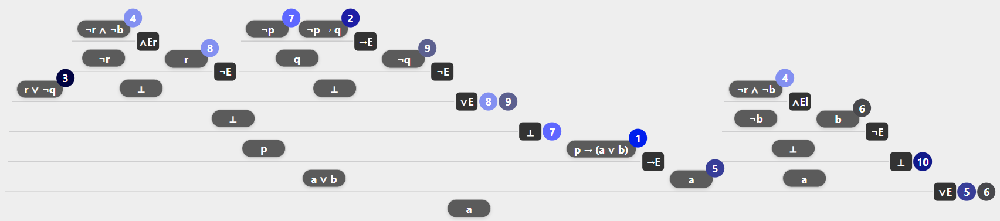

# NDAlgorithm Tutorial by Daniel Macau

This tutorial demonstrates how to use the `NDAlgorithm` to automatically construct human-readable proofs in both **Propositional Logic (PL)** and **First-Order Logic (FOL)**.

Each example below shows how to:
- Set up premises and goals
- Configure proof search parameters
- Use auxiliary terms for instantiations
- Start from partially constructed proof goals

## Requirements

- Java 8 or higher

# Example of an output
Rules appear on the left along with marks, followed by the conclusion and then the hypotheses for each rule.
```markdown
[∨E,5,6] [a.
	[→E] [a ∨ b.
		[⊥,7] [p.
			[∨E,8,9] [⊥.
				[H,3] [r ∨ ¬q.]
				[¬E] [⊥.
					[∧Er] [¬r.
						[H,4] [¬r ∧ ¬b.]]
					[H,8] [r.]]
				[¬E] [⊥.
					[→E] [q.
						[H,7] [¬p.]
						[H,2] [¬p → q.]]
					[H,9] [¬q.]]]]
		[H,1] [p → (a ∨ b).]]
	[H,5] [a.]
	[⊥,10] [a.
		[¬E] [⊥.
			[H,6] [b.]
			[∧El] [¬b.
				[H,4] [¬r ∧ ¬b.]]]]]
```
Which maps to this tree:


# Examples of proofs

Attempt the following proofs using the API.

```java
// Example 1: Propositional Logic Proof
// Goal: prove 'a' from premises: ¬p → q, r ∨ ¬q, p → (a ∨ b), ¬r ∧ ¬b
INDProof proof = new AlgoProofPLBuilder(
        new AlgoProofPLMainGoalBuilder(pl("a"))
                .addPremise(pl("¬p → q"))
                .addPremise(pl("r ∨ ¬q"))
                .addPremise(pl("p → (a ∨ b)"))
                .addPremise(pl("¬r ∧ ¬b"))
)
        .setAlgoSettingsBuilder(new AlgoSettingsBuilder()
                .setTrimStrategy(new SizeTrimStrategy())
                .setTimeout(200)
                .setTotalNodes(5000)
        ).build();

System.out.println("Example 1: \n" + proof);

// Example 2: Propositional Logic with Additional Hypothesis
// Same premises as Example 1, with an added hypothesis 'b'. Goal remains 'a'.
proof = new AlgoProofPLBuilder(
        new AlgoProofPLMainGoalBuilder(pl("a"))
                .addPremise(pl("¬p → q"))
                .addPremise(pl("r ∨ ¬q"))
                .addPremise(pl("p → (a ∨ b)"))
                .addPremise(pl("¬r ∧ ¬b"))
)
        .setGoal(new AlgoProofPLGoalBuilder(pl("a"))
                .addHypothesis(pl("b"))
        ).build();

System.out.println("Example 2: \n" + proof);

// Example 3: First-Order Logic Proof
// Goal: prove ∀x ∃y L(x,y) from premises:
// ∀x ∀y (L(x,y) → L(y,x)), ∃x ∀y L(x,y)
// Uses auxiliary variable 'z' for instantiation
proof = new AlgoProofFOLBuilder(
        new AlgoProofFOLMainGoalBuilder(fol("∀x ∃y L(x,y)"))
                .addPremise(fol("∀x ∀y (L(x,y) → L(y,x))"))
                .addPremise(fol("∃x ∀y L(x,y)"))
                .addTerm(new ASTVariable("z"))
).build();

System.out.println("Example 3: \n" + proof);

// Example 4: First-Order Logic with Partial Hypothesis
// Continue proof from partially derived goal:
// Prove ∃y L(x,y) with additional hypothesis ∀y L(a,y)
proof = new AlgoProofFOLBuilder(
        new AlgoProofFOLMainGoalBuilder(fol("∀x ∃y L(x,y)"))
                .addPremise(fol("∀x ∀y (L(x,y) → L(y,x))"))
                .addPremise(fol("∃x ∀y L(x,y)"))
                .addTerm(new ASTVariable("z"))
)
        .setGoal(new AlgoProofFOLGoalBuilder(fol("∃y L(x,y)"))
                .addHypothesis(fol("∀y L(a,y)"))
        ).build();

System.out.println("Example 4: \n" + proof);
```